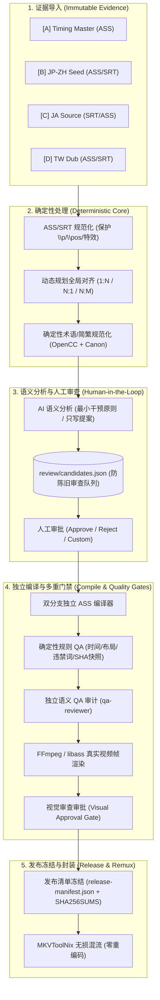

# SubtitleFlow

<p align="center">
  <strong>基于证据驱动的多源字幕生产工作流与质量门禁系统</strong><br>
  <em>Evidence-driven multi-source subtitle production workflow with OpenCode orchestration</em>
</p>

<p align="center">
  
  
  
  
</p>

---

## 📖 简介 / Overview

**SubtitleFlow (`subflow`)** 是一套工业级、高可靠性的多源字幕生产工作流系统。它将传统字幕制作流程彻底解构为五层体系：**不可变证据层、确定性程序层、AI 语义提案层、人类决策审查层与发布验证门禁层**。

系统原生支持通用电影、长篇剧集、动画剧场版及多季连续项目的字幕工程，既可通过全功能的命令行工具（CLI）脱机运行，也可深度协同 **OpenCode V2** 多智能体系统实现全流程半自动编排。

---

## 🎯 为什么需要 SubtitleFlow？ / Why SubtitleFlow?

在传统字幕翻译与二次压制中，时间轴校准、文本翻译、配音台词、术语统合、ASS 样式排版和最终封装往往混杂在一起。如果直接让大语言模型（LLM）改写原始 ASS/SRT 文件，任何微小的模型幻觉或语法误判，都会同时摧毁时间轴、图层定位与字幕特效。

SubtitleFlow 确立了严格的**四源证据输入**与**双独立发布分支**：

### 1. 四源输入证据角色 (Source Roles)

| 角色 | 角色名称 | 权威定义与职责 | 保护级别 |
|:---:|---|---|:---:|
| **A** | **Timing Master** | **视频时间坐标主轴**：定义绝对统一的视频时间轴坐标系 | 绝对基准 |
| **B** | **JP→ZH Translation Seed** | **日配中文精修底稿**：现存的中文翻译底稿，作为中文语义起点 | 证据输入 |
| **C** | **Japanese Source** | **日文原声文字**：日文原始台词，作为源语言语义事实证据 | 证据输入 |
| **D** | **Taiwan Dub Transcript** | **台配实际对白**：公映/正版台湾配音台词的真实措辞证据 | 证据输入 |

### 2. 双独立发布分支 (Release Branches)

- 🇹🇼 **TW 分支（简体台配字幕 - `zh-CN.tw`）**：`A 时间轴` + `D 台湾配音措辞` + `已批准的 Canon 术语表`。忠实于配音真实发音与台词，严禁套用日文直译。
- 🇯🇵 **JP 分支（简日双语字幕 - `zh-CN-ja`）**：`A 时间轴` + `B 中文底稿` + `C 日文原文` + `已批准的 Canon 术语表`。忠实于日文原声语义，严禁受台配意译污染。

---

## 🔄 核心架构与工作流程 / Workflow Architecture



---

## 🛡️ 核心特性与质量保证 / Core Guarantees

1. **不可变证据溯源（Immutable Sources）**：导入后自动锁定只读并生成 SHA-256 哈希基线，严禁原地修改源文件。
2. **DP 动态规划对齐（Dynamic Programming Alignment）**：自动计算全局时钟偏移，支持 1:1、1:N、N:1、N:M 语义分组，拒绝粗暴按行号对齐。
3. **最小编辑干预原则（Minimal Editorial Intervention）**：AI 默认决策为“保留原有译文”，仅在发现否定错译、漏译、主宾颠倒、专有名词、逻辑错误等关键硬伤时提出修改候选。
4. **模型操作权限隔离（Proposal-Only LLM）**：LLM 仅可输出结构化候选提案（JSON）和研究笔记，绝无权限直接改写工作文件和 ASS 源文件。
5. **复杂 ASS 特效强保护（Protected Event Roundtrip）**：绘图命令（`\p1`~`\p4` 及更高阶矢量绘图）、屏幕字定位（`\pos`）、卡拉OK、动态特效及非对白元数据在流水线中全程原样保留。
6. **状态防陈旧级联失效（Stale-State Invalidation）**：源文件、术语表、工作文件或审查决定的任何微小变动，会自动将下游的编译、QA、视觉审查及发布状态标记为失效，杜绝“假绿灯”。
7. **真实视频帧视觉把关（Real Visual QA）**：基于真实视频文件调用 FFmpeg/libass 进行精确时间戳渲染生成 PNG。**渲染成功 ≠ 视觉通过**，必须通过独立视觉审查判定无重叠、无截断、无掉字。
8. **无损封装与发布冻结（Deterministic Remux）**：通过 `mkvmerge` 进行音视频无损直通封装，在发布前完成全量哈希冻结与发布清单固化。

---

## 🚀 快速上手 / Quick Start

### 1. 安装环境

- **基础环境**：Python 3.11+
- **推荐扩展工具**：
  - `OpenCC`：用于台配繁体到简体的规范化转换
  - `FFmpeg / ffprobe`：用于视频探测与真实画面预览渲染
  - `MKVToolNix (mkvmerge)`：用于最终 MKV 无损封装
  - `OpenCode V2`：用于多智能体协同编排

```bash
# 克隆仓库
git clone https://github.com/kiwi4814/SubtitleFlow.git
cd SubtitleFlow

# 使用 pip 创建虚拟环境并安装
python3 -m venv .venv
source .venv/bin/activate
pip install -e '.[full]'

# 检查环境健康状况
subflow doctor
```

*(也可以直接使用 `uv`)*：
```bash
uv sync --extra full
uv run subflow doctor
```

### 2. 命令行基础工作流 (CLI Guide)

```bash
# 1. 初始化项目与作品
subflow project init anime-series --name "动画系列"
subflow title init anime-series movie-01 --name "剧场版 01"

# 2. 导入四源证据文件
subflow source add anime-series movie-01 A /path/to/timing_master.ass
subflow source add anime-series movie-01 B /path/to/jp_zh_seed.ass
subflow source add anime-series movie-01 C /path/to/ja_source.srt
subflow source add anime-series movie-01 D /path/to/tw_dub.ass

# 3. 执行规范化与对齐准备
subflow prepare anime-series movie-01

# 4. 查看当前项目进度与门禁状态
subflow status anime-series movie-01

# 5. 查看并裁决 AI 提出的候选提案
subflow review list anime-series movie-01 --status pending --markdown
subflow review decide anime-series movie-01 cand-0001 approve
subflow review decide anime-series movie-01 cand-0002 reject
subflow review decide anime-series movie-01 cand-0003 custom --text "人工修订的准确译文"

# 6. 编译独立 ASS 字幕
subflow compile anime-series movie-01

# 7. 运行确定性规则 QA
subflow qa anime-series movie-01

# 8. 关联视频并渲染真实画面预览
subflow render anime-series movie-01 jp --video /path/to/video.mkv
subflow render anime-series movie-01 tw --video /path/to/video.mkv

# 9. 人工/视觉审查确认通过
subflow visual-qa mark-complete anime-series movie-01 jp --inspector "QualityTeam" --notes "排版正常，无重叠"
subflow visual-qa mark-complete anime-series movie-01 tw --inspector "QualityTeam" --notes "台配对齐正常"

# 10. 冻结发布清单与最终封装
subflow release anime-series movie-01
subflow remux anime-series movie-01 --video /path/to/video.mkv
```

### 3. OpenCode 智能编排 / OpenCode Orchestration

在仓库根目录下直接启动 OpenCode：

```bash
opencode
```

在对话框中使用内置的 `/subtitle/...` 斜杠指令，系统将自动调用专业 Agent 进行分工协作：

```text
/subtitle/research <project> <title>        # 启动 film-researcher 收集作品背景与专有名词
/subtitle/prepare <project> <title>         # 导入源并完成确定性对齐
/subtitle/run <project> <title>             # 自动向前推进流水线，直到下一个必须由人裁决的门禁
/subtitle/review <project> <title>          # 审查语义修改提案
/subtitle/semantic-qa <project> <title>     # 启动 qa-reviewer 进行高风险语义独立审计
/subtitle/visual-review <project> <title>   # 检查渲染画面并完成视觉门禁审批
/subtitle/release <project> <title>         # 冻结发布版本
/subtitle/remux <project> <title>           # 无损封装 MKV
```

---

## 📂 目录结构说明 / Repository Layout

```text
SubtitleFlow/
├── AGENTS.md                   # 根级 Agent 规则与行为契约
├── opencode.jsonc              # OpenCode V2 权限与全局配置
├── .opencode/
│   ├── agents/                 # 4 类专用智能体 (orchestrator, film-researcher, etc.)
│   ├── skills/                 # 7 项工作流核心技能
│   └── commands/subtitle/      # OpenCode 斜杠指令定义
├── src/subtitleflow/           # 确定性处理核心引擎 (零第三方硬依赖)
│   ├── cli.py                  # CLI 命令行入口
│   ├── normalize.py            # ASS/SSA/SRT 规范化解析器
│   ├── alignment.py            # DP 动态规划多对多对齐
│   ├── review.py               # 提案防陈旧审查状态机
│   ├── compile.py              # 独立 ASS 样式与双语编译器
│   ├── qa.py                   # 确定性静态与布局规则 QA
│   ├── media.py                # FFmpeg 帧渲染与 ffprobe 媒体探测
│   ├── remux.py                # MKVToolNix 封装编排
│   └── state.py                # 强一致性状态机与防陈旧级联
├── projects/                   # 用户工程数据目录 (受 gitignore 保护)
├── docs/                       # 架构设计与规范文档
│   ├── workflow.md             # 13 阶段完整工作流规范
│   ├── data-model.md           # 持久化数据模型说明
│   ├── human-review.md         # 人类决策契约与提案结构
│   ├── opencode.md             # OpenCode V2 集成架构
│   ├── testing.md              # 验证矩阵与压力测试规范
│   └── configuration.md        # 配置项与质量门禁参数
├── examples/                   # 示例数据与合成测试样本
├── tests/                      # 自动化测试套件 (32+ 单元测试与集成测试)
└── verification/               # 真实环境验证证据与报告
```

单个作品（Title）生成的数据结构如下：

```text
projects/<project>/titles/<title>/
├── title.json                  # 单集/单片配置与样式参数
├── source/                     # 不可变 A/B/C/D 证据与 SHA-256 记录
├── normalized/                 # 结构化解析结果 (保留特效标记)
├── research/                   # 背景资料与术语事实报告
├── canon/                      # 作品级术语表与别名映射
├── work/                       # TW/JP 结构化工作文件 (A↔D, A↔B↔C)
├── review/                     # 语义修改候选提案与人类裁决记录
├── release/                    # 最终编译 ASS、发布清单 (Manifest) 与 SHA256
├── qa/                         # 确定性 QA 报告、语义审查审计与预览 PNG 渲染帧
└── state.json                  # 强一致性阶段状态记录
```

---

## 🤖 OpenCode 智能体角色分工 / OpenCode Multi-Agent System

| 智能体 (Agent) | 职责定位 | 推荐模型策略 |
|---|---|---|
| **`subtitle-orchestrator`** | 工作流总控，负责状态感知、推进流程至下一人工门禁 | 高性价比中等推理模型 |
| **`film-researcher`** | 收集作品公映背景、角色对应关系、道具专有名词与上下文 | 快速检索模型 / 强模型 |
| **`semantic-editor`** | 执行最小编辑干预的语义比对，输出结构化候选提案 | 高精度推理模型 |
| **`qa-reviewer`** | 独立审计高风险翻译、违禁词、语境冲突与语气偏差 | 独立模型/与 Editor 异构提示词 |

---

## 🧪 质量验证与测试矩阵 / Verification & Testing

系统经过全面的单元测试、合成端到端测试与高复杂度历史 ASS 压力验证：

```bash
# 1. 语法检查与语法降级兼容性测试 (支持 Python 3.11+)
python3 -m compileall -q src tests tools

# 2. 运行全量单元测试与集成测试
PYTHONPATH=src pytest -q

# 3. 运行覆盖率测试
PYTHONPATH=src pytest -q --cov=subtitleflow --cov-report=term-missing
```

### 压力测试验证指标

- **824 句超长对话历史 ASS 真实测试**：完整走通规范化、DP 对齐、编译、QA 到发布全流程，源文件 SHA-256 前后 100% 保持一致。
- **7,363 个复杂特效/矢量绘图/定位事件测试**：往返编译后保护事件保留率达到 **100%（7,363 / 7,363）**，无一丢失或损坏。
- **状态防陈旧测试**：对上游源文件、工作文件、审查决定的任意篡改均被下游门禁成功捕获并拒绝发布。

---

## 📄 开源许可证 / License

本项目采用 [MIT License](LICENSE) 授权开源。
